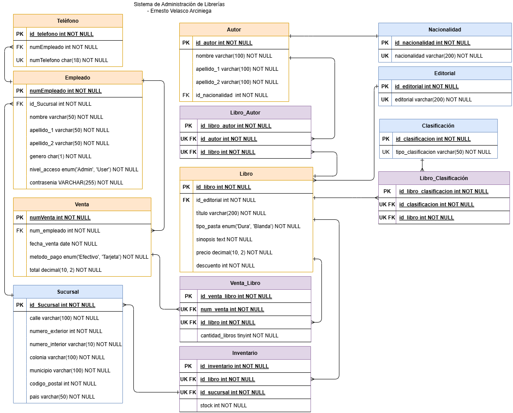

# ENIGMA - Administración de librerías

## Proyecto realizado para el diplomado: Desarrollo de Sistemas con Tecnología Java

### Autor: Ernesto Velasco Arciniega

## Índice

- [Descripción](#descripción)
- [Objetivos](#objetivos)
- [Alcance del proyecto](#alcance-del-proyecto)
- [Tecnologías utilizadas](#tecnologías-utilizadas)
- [Arquitectura del sistema](#arquitectura-del-sistema)
- [Modelo de datos](#modelo-de-datos)
- [Seguridad](#seguridad)
- [Generación de reportes](#generación-de-reporte)
- [Pruebas](#pruebas)
- [Conclusiones y recomendaciones](#conclusiones-y-recomendaciones)
- [Anexo](#anexo)

## Descripción

El presente proyecto consiste en el desarrollo de un sistema web para la gestión interna de una librería física,
diseñado para ser utilizado exclusivamente por empleados autorizados. Su propósito principal es facilitar el control de
libros disponibles en inventario, registrar ventas realizadas por los empleados, y generar reportes detallados de ventas
e inventario en formato PDF.

La aplicación permite realizar operaciones CRUD (crear, leer, actualizar, eliminar) sobre las entidades principales del
negocio: libros, empleados, sucursales, ventas y stock. Asimismo, incorpora autenticación y autorización basada en JWT
para garantizar la seguridad de acceso, diferenciando entre roles de usuario (Admin y User).

El sistema cuenta con una interfaz web sencilla, implementada con Thymeleaf y Bootstrap, que permite a los usuarios
navegar fácilmente entre las funcionalidades disponibles, como registrar una venta, consultar el historial de
transacciones o generar reportes entre rangos de fechas específicos.

La solución está construida con Java y Spring Boot, utilizando JPA para el manejo de datos, y OpenPDF para la generación
de documentos PDF descargables desde el navegador. Toda la información se almacena de forma estructurada en una base de
datos relacional (MariaDB), permitiendo consultas eficientes y consistencia de datos.

## Objetivos

* Desarrollar una aplicación web que permita gestionar el inventario de libros, registrar ventas y generar reportes de
  manera automatizada para los empleados de la librería.
* Implementar un módulo de autenticación y autorización basado en JWT y cookies, que permita distinguir entre roles de
  usuario (Administrador y Usuario).
* Facilitar la administración del catálogo de libros mediante operaciones de alta, baja, modificación y consulta (CRUD).
* Registrar ventas realizadas por los empleados, incluyendo información como libro vendido, cantidad, precio, fecha,
  método de pago y empleado que realizó la venta.
* Implementar la generación de reportes en formato PDF tanto de ventas como de inventario, con filtros por fechas y
  presentación ordenada.
* Proporcionar una interfaz amigable con Thymeleaf y Bootstrap para mejorar la experiencia del usuario.

## Alcance del proyecto

### Funcionalidades incluidas:

* Autenticación y autorización de empleados mediante credenciales y tokens JWT.
* Gestión de empleados (solo para administradores).
* CRUD completo de libros, incluyendo asociación con autor, editorial y clasificación. Gestión de sucursales y
  asignación de stock de libros a través del módulo de inventario.
* Registro de ventas con detalle de cantidad, total, método de pago, fecha y empleado responsable.
* Generación de reportes en formato PDF:
* Reporte de ventas con filtros por fechas.
* Reporte del inventario actual por sucursal.
* Interfaz de usuario desarrollada con Thymeleaf y Bootstrap.

### Límites y exclusiones:

* No se contempla la venta en línea.
* No se incluye pasarela de pago ni integración con bancos.
* No se incluye análisis estadístico avanzado de ventas o predicciones de stock.
* El sistema está enfocado en su uso local, en entorno controlado.

## Tecnologías utilizadas

### Lenguaje de programación:

* Java 17 – Lenguaje principal para la lógica del backend.

### Frameworks y librerías:

* Spring Boot – Framework principal para la construcción del backend y manejo de dependencias.
* Spring Security – Módulo de seguridad para la autenticación y autorización de usuarios mediante JWT.
* Spring Data JPA – Para la persistencia y manejo de datos con base en entidades y repositorios.
* Thymeleaf – Motor de plantillas para el desarrollo del frontend integrado con el backend.
* Bootstrap 5 – Framework CSS para el diseño responsivo y estético de la interfaz de usuario.
* OpenPDF – Librería para la generación de archivos PDF.

### Base de datos:

* MySQL – Sistema de gestión de bases de datos relacional donde se almacena toda la información del sistema.

### Herramientas adicionales:

* Maven – Sistema de gestión de proyectos y dependencias.
* Lombok – Librería para reducir código boilerplate (getters, setters, constructores, etc.).
* Postman – Para pruebas de endpoints (opcional, si se hicieron pruebas).
* Git – Control de versiones del código fuente.
* IDE IntelliJ IDEA – Entorno de desarrollo utilizado.

## Arquitectura del sistema

El sistema está diseñado bajo una arquitectura MVC (Modelo–Vista–Controlador) y sigue principios de capas para una mayor
separación de responsabilidades. Esta estructura facilita el mantenimiento, escalabilidad y reutilización del código.

### Capas

1. Capa de presentación (Vista):

    * Desarrollada con Thymeleaf y Bootstrap 5.
    * Responsable de mostrar la interfaz al usuario y de capturar la interacción (formularios, botones, reportes).
    * Se renderiza dinámicamente desde el backend.

2. Capa de controladores (Controlador):

    * Implementada con Spring MVC.
    * Gestiona las peticiones HTTP (@Controller, @GetMapping, @PostMapping, etc.).
    * Recibe datos de las vistas, coordina el flujo con los servicios y retorna la vista correspondiente.

3. Capa de servicios:

    * Contiene la lógica de negocio de la aplicación.
    * Encapsula reglas como validación de stock, cálculos de total, aplicación de descuentos, generación de reportes en
      PDF, etc.
    * Se comunica con los repositorios para manipular los datos.

4. Capa de persistencia (Repositorios):

    * Utiliza Spring Data JPA para interactuar con la base de datos MySQL.
    * Se encarga de realizar operaciones CRUD sobre las entidades del sistema (Libro, Sucursal, Venta, Empleado, etc.).

5. Base de datos:

    * MariaDB almacena toda la información estructurada.
    * Se relacionan tablas como libro, sucursal, inventario, venta, empleado, entre otras, mediante claves foráneas.

6. Seguridad:

    * La autenticación se maneja con Spring Security usando JWT (JSON Web Tokens) y cookies.
    * Se distingue entre distintos niveles de acceso (Administrador, Usuario).

7. Generación de reportes:

    * Se usa OpenPDF para generar documentos PDF que incluyen reportes de ventas e inventario.
    * Los archivos se generan dinámicamente desde el backend y pueden descargarse desde el navegador.

## Modelo de datos

### Diagrama E-R de la base de datos

## Seguridad

Para garantizar la integridad, confidencialidad y disponibilidad de la información manejada por el sistema, se han
implementado diversas medidas de seguridad, tales como:

* Autenticación y autorización:
  El sistema requiere que los usuarios se autentiquen mediante numero de empleado y contraseña para acceder a las
  funcionalidades. Se implementan roles y niveles de acceso que controlan qué acciones puede realizar cada usuario,
  diferenciando entre empleados con permisos administrativos y usuarios regulares.

* Protección de datos sensibles:
  Las contraseñas de los usuarios se almacenan de forma segura utilizando algoritmos de encriptación robustos (como
  BCrypt), lo que evita que sean accesibles en texto plano.

## Generación de reportes

## Pruebas

## Conclusiones y recomendaciones

## Anexo

### Esquema de la Base de Datos
Para la __CREACIÓN y CARGA__ de la base de datos se tiene que usar el archivo:
> _adminlibrerias_completa.sql_

